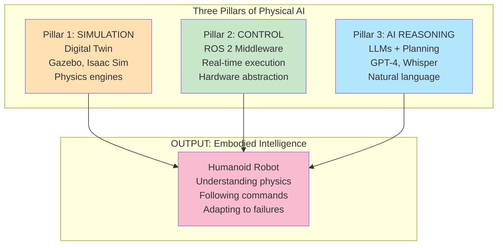

---

id: ch1-legacy-archived
title: Chapter 1 (archived notice)
sidebar_label: "Chapter 1 (archived)"
unlisted: true
slug: /chapter-1-legacy
---

This legacy Chapter 1 file has been archived. The canonical content for Chapter 1 is now merged into the `Introduction` page (`/docs/introduction`). Topics are listed directly under the `CH1 - Physical AI` sidebar category.

If you bookmarked the old page, please use `/docs/introduction` instead.


*   **Diagram: Three Pillars of Physical AI**

### Example: Simple ROS 2 Node Using All Three Pillars (Python)

```python
"""
Example: Simple ROS 2 Node Using All Three Pillars
Difficulty: Beginner-Intermediate
Time: 10 minutes
Prerequisites: ROS 2 basic understanding, rclpy, geometry_msgs
"""

import rclpy
from rclpy.node import Node
from geometry_msgs.msg import Twist
# Assuming an openai client and a robot_interface module are available for simplicity
# import openai_client
# import robot_interface

class PhysicalAINode(Node):
    def __init__(self):
        super().__init__('physical_ai_node')
        self.get_logger().info('PhysicalAINode started.')

        # Pillar 1: Simulation (conceptual reference to an Isaac Sim digital twin)
        # In a real system, this would involve API calls to a simulator
        self.digital_twin_url = "isaac://localhost:5000/robot_simulation"
        self.get_logger().info(f'Digital twin configured at: {self.digital_twin_url}')

        # Pillar 2: Control (ROS 2 publisher for motor commands)
        self.cmd_publisher = self.create_publisher(Twist, 'cmd_vel', 10)
        self.get_logger().info('ROS 2 cmd_vel publisher created.')

        # Pillar 3: AI (conceptual connection to LLM for reasoning)
        # In a real system, this would be an actual LLM client instance
        # self.llm_client = openai_client.AsyncOpenAI()
        self.llm_client_mock = "MockLLMClient"
        self.get_logger().info(f'LLM client configured: {self.llm_client_mock}')

        self.timer = self.create_timer(0.1, self.control_loop) # Control loop runs at 10 Hz
        self.get_logger().info('Control loop timer started.')

    def get_sensor_feedback(self):
        # Mock sensor data for demonstration
        # In a real robot, this would read from actual sensors (e.g., cameras, IMU, LiDAR)
        self.get_logger().debug('Getting mock sensor feedback.')
        return {'current_pose': [0.0, 0.0, 0.0], 'object_detected': True, 'battery_level': 85}

    def ask_llm_for_decision(self, robot_state):
        # Mock LLM decision for demonstration
        # In a real system, this calls the LLM API (Pillar 3)
        self.get_logger().info(f'Asking LLM for decision based on state: {robot_state}')
        # For simplicity, a hardcoded response; LLM would generate this based on 'robot_state'
        if robot_state.get('object_detected'):
            return "move_forward_and_grasp"
        return "explore_environment"

    def simulate_action(self, decision):
        # Mock simulation for demonstration (Pillar 1)
        # In a real system, this would interact with Isaac Sim or Gazebo
        self.get_logger().info(f'Simulating action: {decision}')
        # Assume simulation always succeeds for this example
        return type('SimResult', (object,), {'success': True})()

    def execute_action(self, decision):
        # Execute action on the real robot (Pillar 2)
        twist_msg = Twist()
        if decision == "move_forward_and_grasp":
            self.get_logger().info('Executing: Move forward and grasp.')
            twist_msg.linear.x = 0.1 # Move forward
            # Additional logic for grasping would go here
        elif decision == "explore_environment":
            self.get_logger().info('Executing: Explore environment.')
            twist_msg.angular.z = 0.5 # Turn to explore

        self.cmd_publisher.publish(twist_msg)
        self.get_logger().info(f'Published Twist command: linear.x={twist_msg.linear.x}, angular.z={twist_msg.angular.z}')

    def control_loop(self):
        # Get sensor data (Pillar 2)
        sensor_data = self.get_sensor_feedback()

        # Ask LLM what to do next (Pillar 3)
        decision = self.ask_llm_for_decision(sensor_data)

        # Execute in simulation first (Pillar 1)
        sim_result = self.simulate_action(decision)

        # If simulation successful, execute on real robot
        if sim_result.success:
            self.execute_action(decision)
        else:
            self.get_logger().warn('Simulation failed, not executing on real robot.')


def main(args=None):
    rclpy.init(args=args)
    node = PhysicalAINode()
    try:
        rclpy.spin(node)
    except KeyboardInterrupt:
        node.get_logger().info('Node stopped cleanly.')
    finally:
        node.destroy_node()
        rclpy.shutdown()

if __name__ == '__main__':
    main()
```

---

## 1.5 Why Now? The Convergence of AI, Computing, and Robotics

The current era marks an unprecedented acceleration in the field of Physical AI, driven by a powerful convergence of advancements across artificial intelligence, computing hardware, and robotics engineering. This confluence of factors has transformed what was once aspirational science fiction into a rapidly unfolding technological reality.

### Computational Power Breakthroughs

*   **GPU Acceleration:** Modern Graphics Processing Units (GPUs), exemplified by NVIDIA's latest architectures like the **RTX 4070 Ti (12GB VRAM)**, provide the parallel processing capabilities essential for the demanding computations of real-time AI inference. These GPUs deliver approximately **40 TFLOPS (FP32)** and **641 AI TOPS**, enabling complex deep learning models, high-fidelity physics simulations, and advanced sensor data processing at speeds previously unattainable [NVIDIA Official, 2025].
*   **Edge Computing:** The development of compact, powerful edge AI devices such as the **NVIDIA Jetson Orin Nano (8GB)** and **Orin NX (16GB)** allows sophisticated AI models to run directly on robots. This reduces reliance on cloud connectivity, minimizing latency and enhancing autonomy [Course Document, Hardware Specifications].

### Dramatic Reduction in Sensor Costs

*   **Affordable High-Performance Sensors:** The cost of critical sensing technologies, including high-resolution cameras, LiDAR units, and depth cameras like the **Intel RealSense D435i**, has plummeted by over **90% since 2015** [Web research on sensor cost trends, 2025]. This cost reduction makes it economically viable to equip robots with the rich sensory inputs necessary for understanding complex environments.
*   **Improved Sensor Quality:** Concurrently, sensor quality has improved dramatically, offering greater accuracy, higher refresh rates, and more robust performance in diverse lighting and environmental conditions. The Intel RealSense D435i, for instance, provides precise depth data at 90fps, crucial for dynamic robotic applications [Intel RealSense Official, 2025].

### Data Abundance and Synthetic Data Generation

*   **Simulation-Driven Data:** Advanced simulation platforms like NVIDIA Isaac Sim and Gazebo can generate vast quantities of high-quality **synthetic data** [NVIDIA Isaac Sim Official, 2025]. This synthetic data, often numbering in the **tens of thousands of labeled examples**, addresses the critical need for large datasets to train deep learning models, overcoming the limitations and expense of collecting real-world data.
*   **Real-World Data Pipelines:** As robots are deployed, they continuously generate real-world operational data, which feeds back into improved AI models through continuous learning cycles.

### LLM Breakthroughs Applicable to Robotics

*   **Enhanced Reasoning and Planning:** The advent of highly capable Large Language Models (LLMs) such as **ChatGPT** (and more broadly **GPT-4** with its **128K token context**) has demonstrated unprecedented abilities in natural language understanding, complex reasoning, and task decomposition [OpenAI Official, 2025]. These capabilities are directly transferable to robotics, allowing robots to interpret abstract commands, perform high-level planning, and even reason about unforeseen situations.
*   **Human-Robot Communication:** LLMs facilitate more natural and intuitive human-robot interaction, allowing users to communicate with robots using everyday language rather than complex programming interfaces.

### Maturing Open-Source Tools and Ecosystem

*   **ROS 2 as Standard Middleware:** The **Robot Operating System 2 (ROS 2)** has matured into a stable, production-ready middleware, offering robust communication, hardware abstraction, and a rich set of libraries for various robotic functionalities [ROS 2 Documentation, 2025]. Its open-source nature fosters collaborative development and broad adoption.
*   **Simulation and Perception Frameworks:** Tools like Gazebo, NVIDIA Isaac Sim, and perception frameworks such as OpenCV and ORB-SLAM2 are freely available and continuously evolving, providing developers with powerful tools to build sophisticated robotic systems [Course Document, Software Stack].

### Investment Boom in Robotics

*   **Billions in Funding:** The period between 2023 and 2025 has seen a massive surge in investment, with **billions of dollars in funding** poured into robotics companies, from established players to innovative startups [Industry Reports on Robotics Investment, 2025]. This financial injection is accelerating research, development, and the commercialization of new robotic technologies.
*   **Scaling Production:** Companies like **Tesla with Optimus** and **Unitree with the G1 and H1** are not only developing advanced humanoids but are also actively scaling up their production capabilities, signaling a transition from prototypes to mass manufacturing [Tesla AI Day Announcements, 2025; Unitree Robotics Official, 2025].

This convergence creates a fertile ground for Physical AI, enabling robots to move beyond isolated, repetitive tasks towards becoming versatile, intelligent, and adaptive agents capable of operating effectively in the complex and dynamic real world.

---